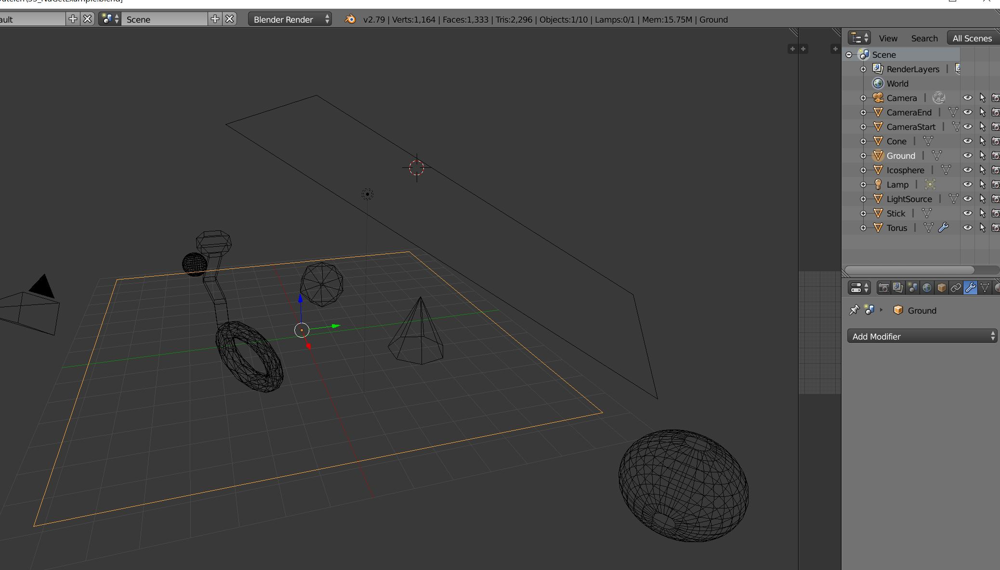
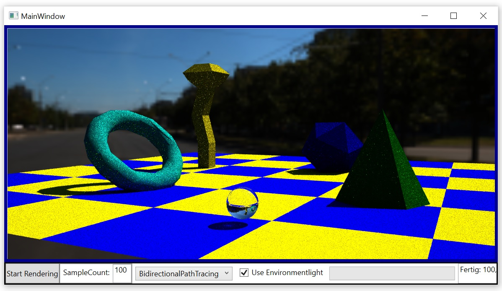
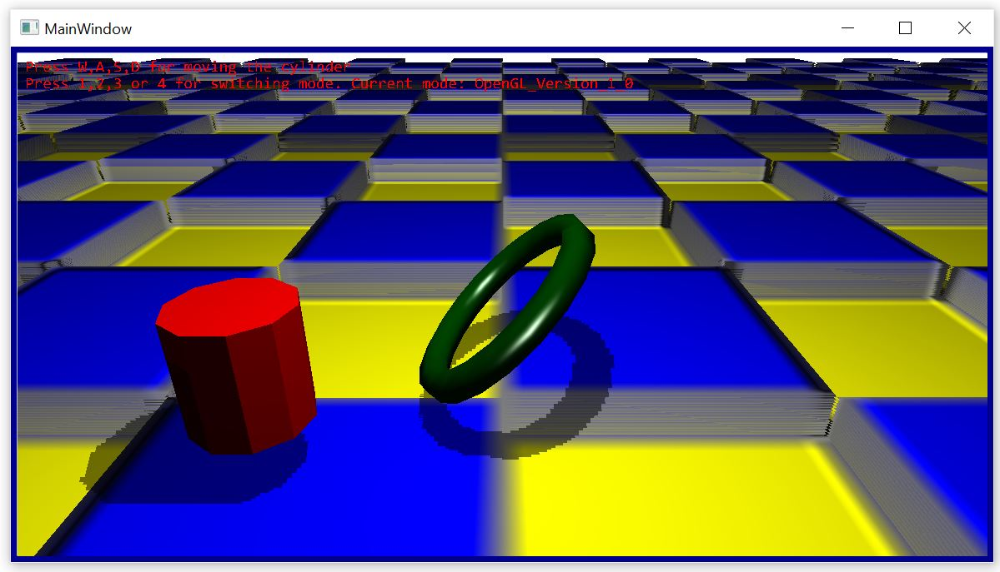
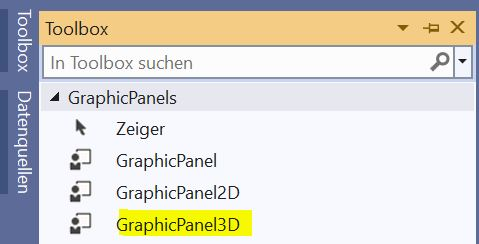
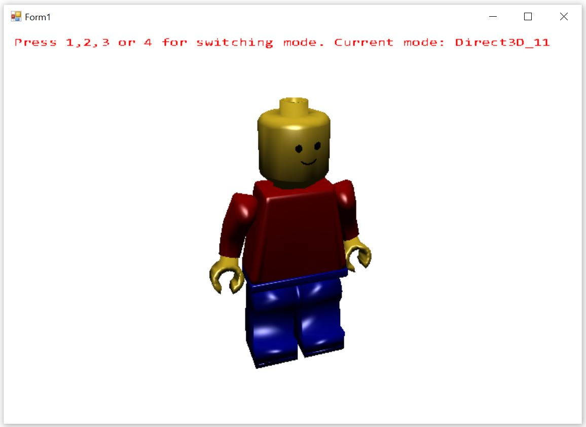
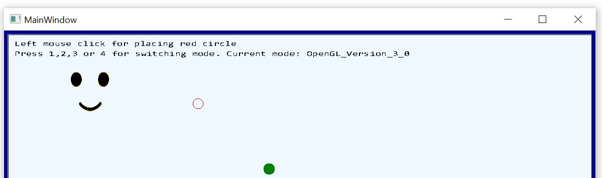

# How to use the GraphicEngine
============================
This project shows how to use the GraphicEngine. There is support for WinForm and WPF. Outputmethods are 2D, 3D and Raytracing. 

## Usage of the Raytracer
-------------------------
### Step 1: Create your scene with blender
Use the Wavefront-Exporter and use the triangulate-checkbox for export.



### Step 2: Create a WPF-Project

You need this in your csproj-File:

```xml
 <UseWindowsForms>true</UseWindowsForms>
```

Add this to your xaml-File to place the GraphicPanel

```xml
<Border BorderThickness="5" BorderBrush="DarkBlue" x:Name="graphicControlBorder"/>
```

For you code-behind you need this
```csharp
 var panel = new GraphicPanel3D() { Width = 100, Height = 100, Mode = Mode3D.OpenGL_Version_3_0 }; //Unter .NET Core kann man leider kein DirectX nutzen
 this.graphicControlBorder.Child = new GraphicControl(panel); //Sowohl die View kennt das GraphicPanel2D um es darstellen zu können

 this.DataContext = new ViewModel(panel);
```

Now you can use the GraphicPanel3D-Object in you ViewModel to send the drawing-commands to the view. In our case we want to use the raytracer to show a blender-file. 
To do this we need to add at first the obj-file:

```csharp
panel.RemoveAllObjekts();
panel.AddWaveFrontFileAndSplit(DataDirectory + "3DScene.obj", false, new ObjectPropertys() 
{ 
    SpecularHighlightPowExponent = 20, 
    NormalInterpolation = InterpolationMode.Flat, 
    Albedo = 0.5f 
});
```

After this we can start the raytracer asynchron with 

```csharp
this.panel.StartRaytracing(this.panel.Width, this.panel.Height, (result) => {}, (error) => {});
```

You can show/update the raytracingresult on the graphicpanel with this line of code:

```csharp
graphicPanel.UpdateProgressImage();
```

This will produce this image.


See the Raytracer-Demo-project for details.


## 3D-Output via WPF
--------------------

You start again like in the raytracer-project by creating a WPF-Project and add the GraphicPanel to the view and viewModel.

If you want to display a 3D-scene you load the data into the GraphicPanel one times with this method:

```csharp
private void Add3DObjects()
{
    panel.RemoveAllObjekts();

    //Ground
    int groundId = panel.AddSquareXY(1, 1, 1, new ObjectPropertys() 
    { 
        Position = new Vector3D(0, 0, 0), 
        Orientation = new Vector3D(-90, 0, 180), 
        Size = 80, 
        Color = new ColorFromTexture() 
        { 
            TextureFile = DataDirectory + "Decal.bmp", 
            TextureMatrix = Matrix3x3.Scale(6, 6) 
        }, 
        ShowFromTwoSides = true, 
        BrdfModel = BrdfModel.Diffus, 
        
    });

    //Use Parallax Mapping for the ground
    var tex = this.panel.GetObjectById(groundId).Color.As<ColorFromTexture>();
    this.panel.GetObjectById(groundId).NormalSource = new NormalFromParallax() 
    { 
        ParallaxMap = tex.TextureFile, 
        TextureMatrix = tex.TextureMatrix, 
        ConvertNormalMapFromColor = true, 
        TexturHeightFactor = 0.04f, 
        IsParallaxEdgeCutoffEnabled = true 
    };


    //Player
    this.playerId = panel.AddCylinder(2, 1, 1, true, 10, new ObjectPropertys() 
    { 
        Position = new Vector3D(0, 2, 0), 
        Orientation = new Vector3D(0, 0, 0), 
        Color = new ColorFromRgb() { Rgb = new Vector3D(1, 0, 0) },
        BrdfModel = BrdfModel.DiffuseAndMirror,
        HasStencilShadow = true,
    });

    panel.AddRing(0.3f, 2, 5, 20, new ObjectPropertys() 
    { 
        Position = new Vector3D(0, 2, 0), 
        Orientation = new Vector3D(0, 0, 45), 
        Size = 1, 
        HasStencilShadow = true, 
        NormalInterpolation = InterpolationMode.Smooth, 
        TextureFile = "#004400", 
        SpecularHighlightPowExponent = 50, 
        ShowFromTwoSides = false 
    });

    //LightSource
    panel.AddSphere(0.1f, 10, 10, new ObjectPropertys() 
    {
        Position = new Vector3D(0, 10, 3),
        Orientation = new Vector3D(0, 0, 45),
        Size = 1.0f,
        TextureFile = "#FFFFFF",
        ShowFromTwoSides = true,
        RasterizerLightSource = new RasterizerLightSourceDescription() { SpotDirection = Vector3D.Normalize(new Vector3D(0, 30, 0) - new Vector3D(0, 75, 30)), SpotCutoff = 180.0f, SpotExponent = 1, ConstantAttenuation = 1.1f },
        RaytracingLightSource = new DiffuseSphereLightDescription() { Emission = 2200}
    });

    panel.GlobalSettings.BackgroundImage = "#FFFFFF";
    panel.GlobalSettings.ShadowsForRasterizer = RasterizerShadowMode.Shadowmap;
    panel.GlobalSettings.Camera = new Camera(new Vector3D(0, 7, 10), new Vector3D(0, -0.5f, -1), 45.0f);
}
```

In the timer-tick-method you can now draw the 3D-Object and add also 2D-content at top:

```csharp
private void Draw()
{
    this.panel.DrawWithoutFlip();
    this.panel.DrawString(10, 10, Color.Red, 15, "Press W,A,S,D for moving the cylinder");
    this.panel.DrawString(10, 30, Color.Red, 15, "Press 1,2,3 or 4 for switching mode. Current mode: " + this.panel.Mode);
    this.panel.FlipBuffer();
}
```

This will produce a 3D-scene where you can move the red cylinder:


See the Wpf3D-Project for details.


## 3D-Output via WinForm
------------------------
Create a new WinForm-application in VisualStudio and add the GraphicEngine-NuGet. After this go the the toolbox and add the GraphicPanel3D-Panel to your MainWindow-Panel.




You can now again add all 3D-objects one time at start (or durring runtime if you would add/remove an object).

 panel.RemoveAllObjekts();

```csharp
 //LegoMan from Wavefront file
 this.legoIds = panel.AddWaveFrontFileAndSplit(DataDirectory + "LegoMan.obj", false, new ObjectPropertys()
 {
     NormalInterpolation = InterpolationMode.Smooth,
     SpecularHighlightPowExponent = 50,
     Size = 0.1f,
 });
 ```
 
In the timer-tick-method you call again the DrawWithoutFlip- and FlipBuffer-Method.
 
```csharp
private void Draw()
{
    this.panel.DrawWithoutFlip();
    this.panel.DrawString(10, 10, Color.Red, 15, "Press 1,2,3 or 4 for switching mode. Current mode: " + this.panel.Mode);
    this.panel.FlipBuffer();
}
```

This will produce a legoman which is spinning.


See the WinForm3D-Project for details.

## 2D-Output via WinForm
------------------------
You create a new WinForm- or WPF-Project and add the GraphicPanel like in the 3D-Examples. But instead of using the Add-Methods for adding some 3D-Objects you are using the draw-commands direct in the 
TimerTick-Method.

```csharp
private void Draw()
{
    this.panel.ClearScreen(Color.AliceBlue);

    this.panel.DrawRectangle(new Pen(Color.Black, 2), 0, 0, this.panel.Width, this.panel.Height);

    this.panel.DrawFillCircle(Color.Green, this.ballPosition, ballRadius);
    this.panel.DrawCircle(Pens.Red, this.mousePosition, 10);

    this.panel.DrawFillRectangle(DataDirectory + "Face_04.png", 10, 10, 300, 200, true, Color.White);

    this.panel.DrawString(10, 10, Color.Black, 15, "Left mouse click for placing red circle");
    this.panel.DrawString(10, 30, Color.Black, 15, "Press 1,2,3 or 4 for switching mode. Current mode: " + this.panel.Mode);


    this.panel.FlipBuffer();
}
```

This will produce a this image with a moving circle:


See the WinForm2D/Wpf2D-Project for details.